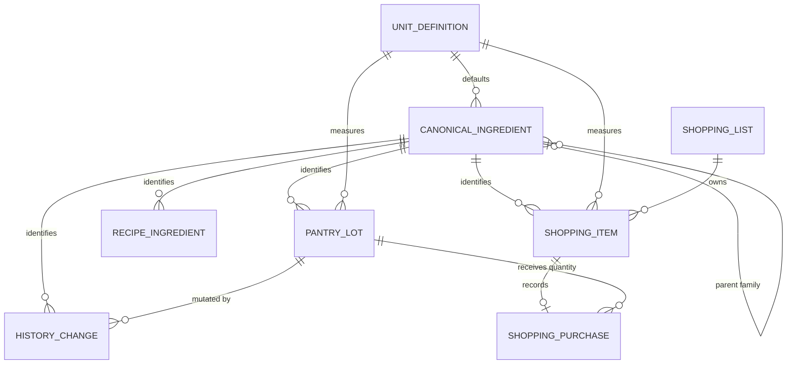
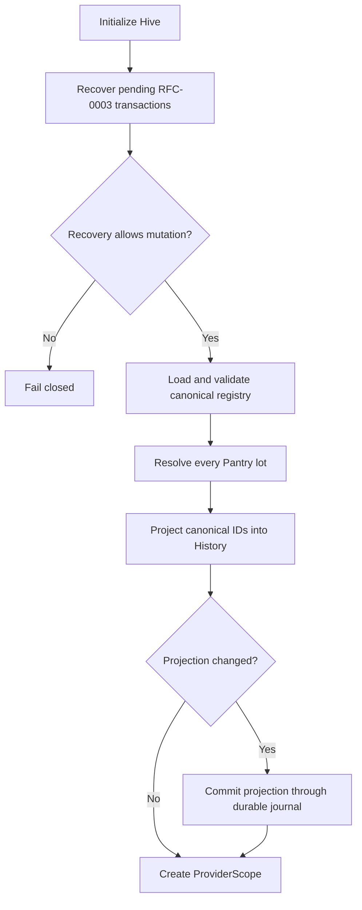

# Canonical Ingredient Data Model

## Relationships

## Persistence

| Model | Identity | Persistence | Version |
|---|---|---|---|
| `CanonicalIngredient` | `id` | Bundled JSON asset | metadata schema/revision |
| `UnitDefinition` | `id` | Compiled offline contract | `version` |
| `Ingredient` Pantry lot | `id` | `InventoryStateEnvelope` in Hive | schema 2 |
| `RecipeIngredient` | canonical `id` | Bundled recipe assets | recipe version |
| `CookingHistoryChange` | Pantry `ingredientId` plus canonical ID | `InventoryStateEnvelope` in Hive | parent history schema 2 |
| `ShoppingList` | `id` | `InventoryStateEnvelope.shoppingLists` under `shopping.v1` | metadata version 1 + list revision |
| `ShoppingItem` | list-scoped `id` plus canonical ingredient/unit identity | parent Shopping list | metadata version 2 |
| `ShoppingPurchase` | purchase transaction ID | parent Shopping item | metadata version 1 |
| Migration diagnostics | record ID and issue type | startup provider for support | migration version 2 |

The durable transaction journal stores complete before/after envelopes, so
canonical migration is recoverable with the same all-or-nothing guarantees as
Pantry and cooking-history mutations.

## Legacy Migration

Startup order:

For each Pantry lot:

- a valid existing canonical ID wins;
- otherwise the name resolves through canonical/localized/alias/keyword data;
- a known unit maps to a canonical unit ID;
- an unknown or ambiguous ingredient receives a deterministic `unmapped_*` ID;
- an unknown unit receives a deterministic unmapped unit ID;
- name, display unit, quantity, lot ID, expiry, favorites, and timestamps are
  preserved.

History changes inherit the Pantry lot mapping when the lot still exists.
Orphaned history changes resolve independently and are reported when unknown.

The operation is idempotent. Re-running a completed migration produces no
revision or journal mutation.

## Mutation Paths

New Pantry lots are normalized before `replacePantry`. Cooking deduction adds
canonical IDs to `PantryQuantityChange`; history creation, adjustment, cancel,
and undo preserve those IDs.

## Shopping Compatibility

`ShoppingEngine` resolves Recipe aliases, converts multiple Recipe units to the
canonical default purchase unit, subtracts Pantry, and merges existing active
items by canonical ingredient ID. `InventoryTransactionCoordinator` rejects
unknown or redirected IDs, incompatible units, duplicate active canonical
entries, negative quantities, and category mismatches.

`ShoppingPurchase` stores the exact affected Pantry lot and before/after
quantity. Purchase and undo update Pantry and Shopping inside one versioned
envelope. Package sizing, retailer/catalog identity, and price remain
intentionally unmodeled.

Unknown legacy records do not silently participate in Recipe or Shopping joins
until mapped. This preserves data while preventing false identity.
