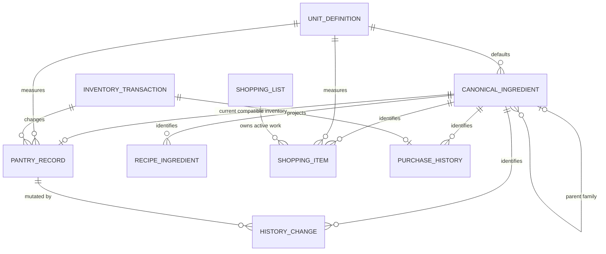
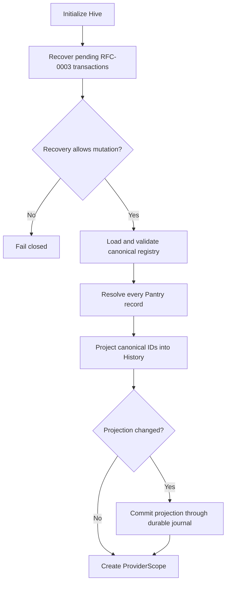

# Canonical Ingredient Data Model

## Relationships

The Pantry cardinality represents the current product invariant for compatible
mapped units: one persisted inventory record per resolved canonical ingredient.
Legacy duplicates remain readable and are consolidated when the canonical
ingredient is added, updated, or completed from Shopping. Incompatible units are
not silently combined.

## Persistence

| Model | Identity | Persistence | Version |
|---|---|---|---|
| `CanonicalIngredient` | `id` | Bundled JSON asset | metadata schema/revision |
| `UnitDefinition` | `id` | Compiled offline contract | `version` |
| `Ingredient` Pantry record | `id` plus resolved canonical identity | `InventoryStateEnvelope` in Hive | schema 2 |
| `RecipeIngredient` | canonical `id` | Bundled recipe assets | recipe version |
| `CookingHistoryChange` | Pantry `ingredientId` plus canonical ID | `InventoryStateEnvelope` in Hive | parent history schema 2 |
| `ShoppingList` | `id` | `InventoryStateEnvelope.shoppingLists` under `shopping.v1` | metadata version 1 + list revision |
| `ShoppingItem` | list-scoped `id` plus canonical ingredient/unit identity | parent Shopping list | metadata version 2 |
| Legacy `ShoppingPurchase` | purchase transaction ID | legacy parent Shopping item | metadata version 1 |
| `InventoryTransactionRecord` | transaction ID | durable Hive journal | transaction schema 1 |
| `PurchaseHistoryEntry` | Pantry transaction ID | read projection from committed journal snapshots | projection version 1 |
| Migration diagnostics | record ID and issue type | startup provider for support | migration version 2 |

The durable journal stores complete before/after envelopes. Canonical migration,
Shopping completion, Purchase History, Undo, and restart recovery therefore share
the same all-or-nothing data instead of duplicating snapshots across models.

`CanonicalIngredient` also owns `preferredUnitId`, ordered
`recommendedUnitIds`, and optional `unitFamily`. These values guide new input and
conversion selection. Changing recommendations does not rewrite historical
quantities or units.

## Legacy Migration

Startup order:

For each Pantry record:

- a valid existing canonical ID wins;
- otherwise a stable registry key, localized name, alias, or keyword resolves
  through the registry;
- a known unit maps to a canonical unit ID;
- an unknown or ambiguous ingredient receives a deterministic `unmapped_*` ID;
- an unknown unit receives a deterministic unmapped unit ID; and
- name, display unit, quantity, record ID, expiry, favorites, and timestamps are
  preserved.

History changes inherit the Pantry mapping when the record still exists.
Orphaned changes resolve independently and are reported when unknown. Migration
is idempotent and does not silently consolidate incompatible records.

## Canonical Merge

`PantryCanonicalMergeService` accepts the current Pantry snapshot and one
incoming record in either add or replace mode.

Resolution priority:

1. canonical ID including registry redirects;
2. stable registry key;
3. localized/alias registry lookup.

Display-name equality is not an identity rule.

For all existing records resolving to the target canonical ingredient, the
service:

1. chooses a deterministic primary record, preferring the incoming unit and then
   oldest creation identity;
2. resolves every canonical unit;
3. converts compatible quantities into the primary unit;
4. rounds once using the Unit Contract;
5. consolidates duplicate compatible records;
6. preserves relevant favorite, expiry, and presentation metadata; and
7. returns before/after `PantryQuantityChange` records for the transaction.

Unknown or incompatible conversions return a typed failure with no output
snapshot.

## Mutation Paths

Manual Pantry add uses add semantics. Manual update removes the edited record's
old value before merging the replacement. Shopping completion uses add semantics
and removes the active Shopping item in the same envelope commit.

Cooking deduction and History adjustment continue to target persisted record IDs
and carry canonical IDs in `PantryQuantityChange`.

## Shopping and Purchase History Compatibility

`ShoppingEngine` resolves Recipe aliases, converts Recipe units to default
purchase units, subtracts Pantry, and merges active demand by canonical ID.
Regeneration excludes legacy purchased/archived records.

`ShoppingCompletionCoordinator` uses the shared Pantry merge service, removes the
active Shopping item, and commits `shoppingPurchase`. `PurchaseHistoryProjector`
derives the history record from the journal's before/after envelopes. It records:

- timestamp;
- resolved canonical identity;
- purchased quantity/unit;
- source Recipe IDs;
- Shopping list/item IDs;
- Pantry transaction ID; and
- affected Pantry record IDs.

Undo commits `undoShoppingPurchase`, selectively restores affected Pantry records
and the active Shopping item, and removes the projected Purchase History entry.

Legacy lifecycle fields and embedded `ShoppingPurchase` receipts remain readable
for backward compatibility but are not part of the current actionable Shopping
projection.

Unknown legacy records do not silently participate in Recipe, Pantry merge, or
Shopping joins until resolved. This preserves data while preventing false
identity.
