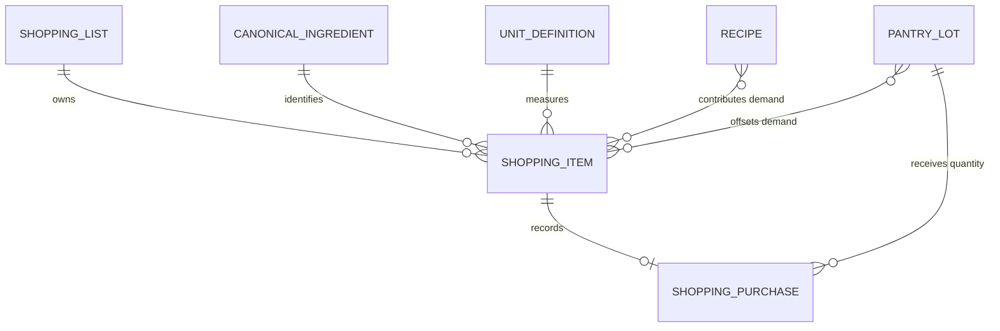
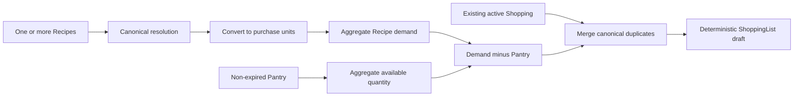
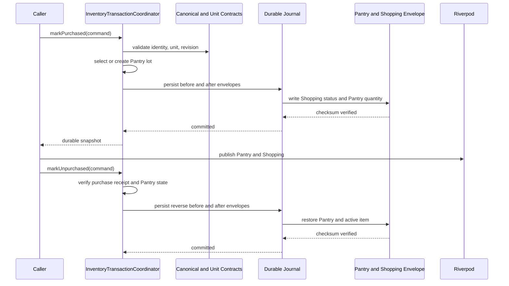

# Shopping Domain and Engine

## Scope

SF-001 established the offline Shopping aggregate and repository boundary.
SF-002 adds deterministic generation, item lifecycle mutations, and
transaction-safe Pantry synchronization. It does not add Shopping UI, retailer
integration, price, package sizing, barcode scanning, cloud synchronization,
AI, or Recommendation changes.

## Aggregate

`ShoppingList` is the aggregate root. It owns:

- globally unique list ID;
- name and planning status;
- optimistic-concurrency revision;
- immutable `ShoppingItem` collection;
- timestamps; and
- metadata version.

`ShoppingItem` version 2 contains:

- list-scoped item ID;
- canonical ingredient and unit IDs;
- deterministic display name and category;
- positive, unit-rounded quantity;
- source plus sorted source Recipe IDs;
- lifecycle status: `active`, `purchased`, or `archived`;
- optional `ShoppingPurchase` receipt;
- timestamps; and
- metadata version.

One list may contain at most one active item for a canonical ingredient.
Purchased and archived entries may coexist with a new active requirement
because completed entries are audit records, not outstanding demand.

## Purchase Receipt

Every purchased or archived item owns one immutable `ShoppingPurchase`:

- purchase transaction ID;
- affected Pantry lot ID;
- whether the transaction created that lot;
- Pantry canonical unit ID;
- quantity before and after purchase; and
- purchase timestamp.

The receipt is sufficient to undo without restoring an entire stale Pantry
snapshot. Undo succeeds only when the affected Pantry lot still matches the
recorded post-purchase state. If Pantry changed later, undo fails closed rather
than overwriting newer inventory.

## Relationships

## Shopping Engine

`ShoppingEngine.generate` is a pure domain operation. It accepts one or more
Recipe/serving selections, current Pantry, and an optional existing list.

Deterministic generation order:

1. Resolve Recipe ingredient IDs, aliases, and localized names through the
   canonical registry.
2. Scale every included ingredient by requested servings.
3. Convert each requirement to the ingredient's default purchase unit.
4. Sum all Recipe requirements by canonical ingredient ID.
5. Sum non-expired Pantry quantities in the same target unit.
6. Calculate `max(total requirement - Pantry quantity, 0)`.
7. Merge existing active Shopping entries by canonical ID and compatible unit.
8. Preserve a larger manual quantity; otherwise replace generated demand with
   the current shortage.
9. Remove generated demand now fully covered by Pantry.
10. Round once with the target unit precision and sort deterministically.

Invalid or incompatible conversions fail the complete generation. The engine
never partially returns a list and never mutates Recipe, Pantry, Shopping, or
Recommendation state.

## Repository Boundary

`ShoppingRepository` remains read-only:

- `getLists`;
- `getList`.

`LocalShoppingRepository` projects lists from the consistent
`InventoryStateEnvelope`. It has no `save`, `put`, or `delete` API.
`InventoryTransactionCoordinator.mutateShopping` is the only durable write
boundary.

## Mutation Contract

`ShoppingMutation` supports:

| Mutation | Behavior |
|---|---|
| `upsertList` | Create a list or commit an engine-generated aggregate |
| `removeList` | Remove a list without purchase receipts |
| `addItem` | Add one active canonical item |
| `removeItem` | Remove one active item |
| `updateQuantity` | Apply a positive compatible quantity and unit |
| `markPurchased` | Atomically mark purchased and add quantity to Pantry |
| `markUnpurchased` | Atomically restore Pantry and reactivate the item |
| `archiveCompleted` | Move all purchased items to archived |
| `restoreArchived` | Move all archived items back to purchased |
| `clearCompleted` | Remove purchased and archived entries without changing Pantry |

Every command carries a transaction ID, expected envelope revision, expected
list revision, list/item identity, and command timestamp. Completed entries
cannot be changed through generic upsert/remove operations.
`clearCompleted` is terminal for local purchase undo because it deliberately
removes the completed entry and its receipt; undo must run before clearing.

## Purchase Commit and Undo

For an existing compatible Pantry lot, purchase increments that lot. If none
exists, purchase creates a mapped lot with an ID derived from the globally
unique transaction ID. Undo restores the prior quantity or removes the lot
created by that purchase.

## Idempotency and Recovery

- Repeating the same transaction ID and command returns the original durable
  result.
- Reusing a transaction ID for different content fails closed.
- A second purchase command for an already purchased/archived item is a
  semantic no-op.
- A second unpurchase command for an active item is a semantic no-op.
- Archive, restore, and clear commands are semantic no-ops when their target
  set is already empty.
- All other stale global or list revisions conflict.
- Startup recovery uses the RFC-0003 journal before providers are created.
- Crash recovery and rollback operate on the complete Pantry + History +
  Shopping envelope, never on one projection alone.

## Persistence and Versioning

Shopping remains inside the checksummed `InventoryStateEnvelope`; there is no
Shopping-specific Hive box.

- Envelope schema version: `1`.
- Reader version `1`: Pantry and History.
- Reader version `2`: `shopping.v1` from SF-001.
- Reader version `3`: `shopping.engine.v1`, item lifecycle, purchase receipts,
  and Pantry synchronization.
- SF-002 reads version-1 and version-2 envelopes without rewriting them.
- The first SF-002 Shopping mutation upgrades Shopping items and adds both
  Shopping capabilities in one journaled commit.

## Invariants

- Quantities are finite, positive, and deterministic at unit precision.
- Unknown or redirected canonical IDs cannot be durably written.
- Item units must convert to the canonical default purchase unit.
- Active canonical ingredient IDs are unique within a list.
- Purchased and archived items always have a valid purchase receipt.
- Active items never have a purchase receipt.
- A purchase changes Shopping and Pantry in the same commit.
- Undo never overwrites a Pantry lot changed after purchase.
- Generic upsert/remove cannot erase completed purchase records.
- Riverpod publishes Shopping and Pantry only after durable success.

## Validation Evidence

- `test/features/shopping/shopping_engine_test.dart`
- `test/features/shopping/shopping_engine_transaction_test.dart`
- `test/features/shopping/shopping_entities_test.dart`
- `test/features/shopping/shopping_transaction_integration_test.dart`
- `test/features/shopping/shopping_hive_integration_test.dart`
- `test/features/shopping/shopping_provider_test.dart`
- `test/features/pantry/data/hive_inventory_commit_repository_test.dart`

## Deferred Work

Package-size rounding, retailer/catalog identity, pricing, barcode input,
cloud synchronization, and cross-device conflict resolution remain out of
scope. The SF-003 presentation workflow is documented in
[Shopping UI](12_SHOPPING_UI.md).
