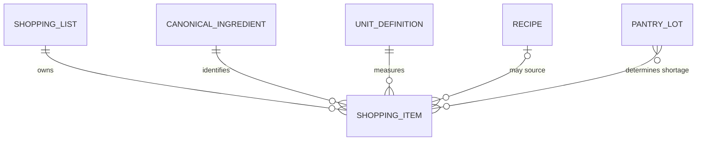
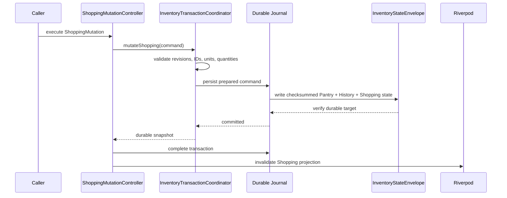

# Shopping Foundation Domain Model

## Scope

SF-001 implements the offline core Shopping domain and its durable transaction
boundary. It does not implement Shopping UI, purchase completion, package
sizing, retailer identity, price, cloud synchronization, AI, or Recommendation
changes.

## Entities

### ShoppingList

`ShoppingList` is the aggregate root:

- globally unique `id`;
- user-facing `name`;
- `ShoppingStatus` (`active` or `archived`);
- aggregate `revision` for optimistic concurrency;
- immutable collection of `ShoppingItem`;
- `createdAt` and `updatedAt`; and
- metadata version.

Deleting a list removes the aggregate. Archiving is planning metadata only and
does not represent purchasing.

### ShoppingItem

`ShoppingItem` contains:

- list-scoped unique `id`;
- `canonicalIngredientId`;
- user-facing display name derived from the canonical registry;
- positive quantity;
- canonical `unitId`;
- `ShoppingCategory` derived from the canonical ingredient category;
- `ShoppingSource`;
- optional source reference;
- timestamps; and
- metadata version.

One list cannot contain the same canonical ingredient and unit pair twice.
Package aggregation is deferred, so items with different canonical units are
not automatically merged.

### ShoppingCategory

Categories are deterministic projections used for organization:

- produce;
- protein;
- seafood;
- dairy and eggs;
- grains;
- seasonings;
- beverages;
- frozen;
- household; and
- other.

### ShoppingStatus

Only planning lifecycle is modeled:

- `active`;
- `archived`.

Purchase states are excluded from SF-001.

### ShoppingSource

- `manual`: created directly from a canonical ingredient;
- `pantryShortage`: derived from Pantry analysis;
- `recipe`: derived from a Recipe and current Pantry.

Derived sources require `sourceReferenceId`. No AI or Recommendation source is
defined.

## Relationships

## Repository Boundary

`ShoppingRepository` exposes only reads:

- `getLists`;
- `getList`.

`LocalShoppingRepository` reads the consistent snapshot from
`InventoryCommitRepository`. There is intentionally no Shopping repository
write method, preventing application or presentation code from bypassing the
transaction engine.

## Mutation Contract

`ShoppingMutation` supports:

- `upsertList`;
- `removeList`.

Each command carries:

- explicit or coordinator-generated transaction ID;
- expected global envelope revision;
- list ID;
- expected list revision;
- command timestamp; and
- the list payload when upserting.

No Riverpod Shopping state is invalidated or refreshed for a failed commit.

## Persistence and Recovery

Shopping lists are serialized inside `InventoryStateEnvelope` under capability
`shopping.v1`.

- Envelope schema version remains `1`.
- Current minimum reader version is `2` after Shopping is written.
- Pre-Shopping envelopes omit both the capability and Shopping payload, so
  their existing checksums remain valid.
- First Shopping mutation adds `shopping.v1`, advances the global revision,
  and commits through the RFC-0003 journal.
- Before/after journal envelopes include Shopping state, so rollback and
  restart recovery restore the whole state.
- No cloud, network dependency, or Shopping-specific Hive box exists.

## Recipe and Pantry Integration

`ShoppingDraftBuilder.fromRecipe`:

1. scales Recipe quantities for requested servings;
2. compares them with non-expired Pantry quantities;
3. uses canonical ingredient matching and the shared unit contract;
4. creates items only for shortages;
5. omits optional shortages by default; and
6. records the Recipe ID as the source reference.

This is a pure planning operation. It does not mutate Pantry, Recipe, Shopping,
or Recommendation state.

## Invariants

- Shopping list IDs are unique and non-empty.
- Item IDs are unique within a list.
- Every item has a registry-backed canonical ingredient ID.
- Redirected and unknown IDs are rejected at the durable write boundary.
- Every item has a canonical unit ID.
- Quantities are finite and greater than zero.
- Item category matches canonical ingredient metadata.
- Derived items have a source reference.
- Global and list revisions must both match before update or removal.
- Duplicate transaction IDs with the same command are idempotent.
- A duplicate transaction ID with different content fails closed.
- Every Shopping mutation is persisted through
  `InventoryTransactionCoordinator`.

## Validation Evidence

- `test/features/shopping/shopping_entities_test.dart`
- `test/features/shopping/shopping_draft_builder_test.dart`
- `test/features/shopping/shopping_transaction_integration_test.dart`
- `test/features/shopping/shopping_provider_test.dart`
- `test/features/shopping/shopping_hive_integration_test.dart`
- `test/features/pantry/domain/inventory_transaction_model_test.dart`
