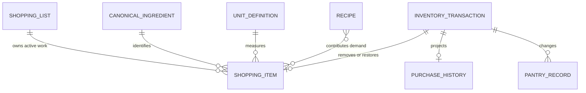
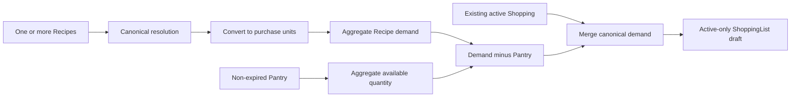

# Shopping Domain and Engine

## Scope

SF-001 established the offline Shopping aggregate and repository boundary.
SF-002 added deterministic generation and durable Pantry synchronization.
SF-003 exposes the user workflow. The current product direction defines Shopping
as unfinished work only and Purchase History as the separate audit projection.

Retailer integration, pricing, package sizing, barcode scanning, cloud
synchronization, AI, and Recommendation behavior remain out of scope.

## Actionable Aggregate

`ShoppingList` remains the aggregate root and owns:

- globally unique list ID;
- name;
- optimistic-concurrency revision;
- immutable active `ShoppingItem` collection;
- timestamps; and
- metadata version.

The persisted `ShoppingItem` version remains backward compatible with legacy
`active`, `purchased`, and `archived` records plus optional `ShoppingPurchase`
receipts. The current aggregate projection exposes active items only:

- list-scoped item ID;
- resolved canonical ingredient and unit IDs;
- deterministic display name and category;
- positive, unit-rounded quantity;
- source plus sorted Recipe source IDs;
- timestamps; and
- metadata version.

One list may contain at most one active item for a resolved canonical ingredient.
Legacy non-active records remain readable but are not outstanding demand, are
not rendered, and are not copied into regenerated lists.

## Purchase History

A completed purchase is represented by a committed `shoppingPurchase`
transaction, not by a Completed Shopping item.

`PurchaseHistoryProjector` derives `PurchaseHistoryEntry` from the durable
journal's before/after envelopes:

- purchase transaction ID and timestamp;
- resolved canonical ingredient identity and display name;
- purchased quantity and unit;
- source Recipe IDs;
- Shopping list and item IDs; and
- affected Pantry record IDs.

The journal snapshots already contain the complete data required for restart
recovery and Undo, so Purchase History does not own another Hive box or duplicate
write model. Legacy embedded `ShoppingPurchase` receipts remain projectable when
a journal record is unavailable.

## Relationships



## Shopping Engine

`ShoppingEngine.generate` is a pure domain operation. It accepts one or more
Recipe/serving selections, current Pantry, and an optional existing list.

Deterministic generation order:

1. Resolve Recipe ingredient IDs, aliases, and localized names through the
   canonical registry.
2. Scale every included ingredient by requested servings.
3. Convert each requirement to the ingredient's default purchase unit.
4. Sum all Recipe requirements by canonical ingredient ID.
5. Sum non-expired Pantry quantities in the same target unit.
6. Calculate `max(total requirement - Pantry quantity, 0)`.
7. Merge existing active Shopping entries by canonical ID and compatible unit.
8. Preserve a larger active manual quantity; otherwise replace generated demand
   with the current shortage.
9. Remove demand fully covered by Pantry.
10. Drop legacy purchased/archived records from the regenerated projection.
11. Round once at target-unit precision and sort deterministically.

Invalid or incompatible conversions fail the complete generation. The engine
never partially returns a list and never mutates Recipe, Pantry, Shopping, or
Recommendation state.



## Repository Boundary

`ShoppingRepository` remains read-only:

- `getLists` returns active-only list projections;
- `getList` returns one active-only list projection; and
- `getPurchaseHistory` returns the durable Purchase History projection.

`LocalShoppingRepository` reads the consistent `InventoryStateEnvelope` and
transaction journal. It has no `save`, `put`, or `delete` API.

## Mutation Boundaries

`InventoryTransactionCoordinator.mutateShopping` remains the durable boundary
for active list maintenance:

| Mutation | Current behavior |
|---|---|
| `upsertList` | Create or replace an active engine-generated aggregate |
| `removeList` | Remove a list allowed by legacy compatibility validation |
| `addItem` | Add one active canonical item |
| `removeItem` | Remove one active item |
| `updateQuantity` | Apply a positive compatible quantity and unit |

Legacy `markPurchased`, `markUnpurchased`, `archiveCompleted`,
`restoreArchived`, and `clearCompleted` APIs remain implemented only so existing
data, older tests, and reader-version compatibility are not broken. The current
Shopping UI does not call them.

`ShoppingCompletionCoordinator` owns the current product workflow:

- `completeItem`;
- `undoCompletion`; and
- durable presentation completion.

## Complete Item Contract

```mermaid
sequenceDiagram
    participant Caller
    participant Completion as ShoppingCompletionCoordinator
    participant Merge as PantryCanonicalMergeService
    participant Journal as Durable Journal
    participant Envelope as Inventory Envelope
    participant Riverpod

    Caller->>Completion: completeItem(listId, revision, itemId)
    Completion->>Completion: validate active item and revision
    Completion->>Merge: resolve and merge canonical inventory
    Merge-->>Completion: one Pantry snapshot or typed failure
    Completion->>Completion: remove Shopping item
    Completion->>Journal: commit before and after envelopes
    Journal->>Envelope: write Pantry plus active Shopping
    Envelope-->>Journal: checksum verified
    Journal-->>Completion: committed
    Completion-->>Caller: durable snapshot and transaction ID
    Caller->>Riverpod: publish Pantry; invalidate Shopping/history
```

The complete operation is atomic. A successful transaction:

1. resolves canonical identity by canonical ID redirect, stable registry key,
   then localized/alias registry lookup;
2. converts every compatible Pantry candidate and the purchase into one
   deterministic primary unit;
3. consolidates compatible canonical duplicates into one Pantry record;
4. removes the active Shopping item; and
5. creates a durable Purchase History projection through the journal record.

Unknown or incompatible units return a typed validation failure. No partial
Pantry, Shopping, or history state is published.

## Pantry Canonical Merge Contract

`PantryCanonicalMergeService` is shared by Shopping completion and manual Pantry
add/update. It owns:

- canonical resolution;
- compatible-unit conversion;
- deterministic primary-record selection;
- quantity rounding;
- duplicate consolidation;
- favorite/metadata preservation; and
- typed failure for unknown or incompatible units.

Display-name equality is never an identity rule. A localized display name may
only be passed into the registry's alias compatibility lookup.

Manual update uses replace semantics: the edited record's old quantity is
removed before the new value is merged. Manual add and Shopping completion use
add semantics.

## Undo Contract

Undo accepts the original purchase transaction ID. It:

1. reads the original before/after envelopes;
2. derives the removed Shopping item and affected Pantry record IDs;
3. verifies those Pantry records still equal the purchase's post-state;
4. rejects an equivalent active Shopping item recreated after completion;
5. restores only the affected Pantry records;
6. restores the Shopping item as active; and
7. commits an `undoShoppingPurchase` inverse transaction.

The inverse journal record removes the projected Purchase History entry. Undo
fails closed when newer Pantry or Shopping state would be overwritten.

## Idempotency and Recovery

- Repeating the same transaction ID and command returns the original durable
  result.
- Reusing a transaction ID for different content fails closed.
- Completing an item already represented by open Purchase History returns an
  already-completed result.
- Repeating Undo after the item and Pantry state are restored returns
  already-undone.
- Stale envelope or list revisions conflict.
- Startup recovery uses the RFC-0003 journal before providers are created.
- Crash recovery and rollback operate on the complete Pantry + Cooking History +
  Shopping envelope, never on one projection alone.

## Persistence and Versioning

Shopping remains inside the checksummed `InventoryStateEnvelope`; there is no
Shopping-specific or Purchase-History-specific Hive box.

- Envelope schema version: `1`.
- Reader version `1`: Pantry and Cooking History.
- Reader version `2`: `shopping.v1` from SF-001.
- Reader version `3`: `shopping.engine.v1` and atomic Pantry synchronization.
- Legacy lifecycle fields and embedded receipts remain readable.
- The actionable-only redesign uses existing transaction kinds and journal
  snapshots, so it does not require a reader or envelope version increase.

## Current Invariants

- Shopping projections contain unfinished active work only.
- Quantities are finite, positive, and deterministic at unit precision.
- Active canonical ingredient IDs are unique within a list.
- Completion changes Pantry and removes Shopping in the same commit.
- Purchase History exists only for committed, not-undone purchases.
- Compatible Pantry records for the completed/added/updated canonical ingredient
  are consolidated into one record.
- Incompatible units do not silently merge.
- Undo never overwrites Pantry or Shopping state changed after purchase.
- Riverpod publishes only after durable success.

## Validation Evidence

- `test/features/shopping/shopping_completion_coordinator_test.dart`
- `test/features/shopping/shopping_engine_test.dart`
- `test/features/shopping/shopping_engine_transaction_test.dart`
- `test/features/shopping/shopping_ui_test.dart`
- `test/features/shopping/shopping_ui_integration_test.dart`
- `test/features/shopping/shopping_view_provider_test.dart`
- `test/core/providers/pantry_canonical_merge_provider_test.dart`
- existing transaction, repository, Hive, recovery, and provider suites

## Deferred Work

Package-size rounding, retailer/catalog identity, pricing, barcode input, cloud
synchronization, cross-device conflict resolution, and a dedicated Purchase
History screen remain outside this change. The Purchase History read boundary is
available for that future surface.

The SF-003 presentation workflow is documented in
[Shopping UI and Pantry Completion Workflow](12_SHOPPING_UI.md).
