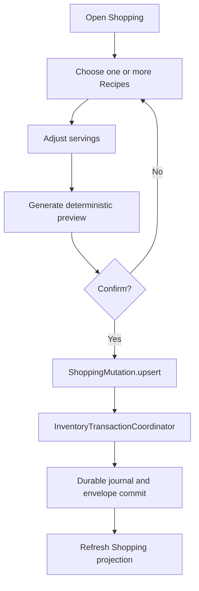
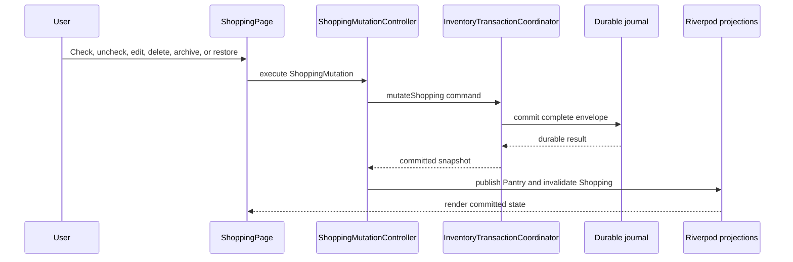

# Shopping UI

## Scope

SF-003 adds the first user-facing Shopping experience on top of the approved
Shopping Domain and Shopping Engine. It does not change transaction semantics
and does not add pricing, retailers, package sizing, barcode scanning, cloud
synchronization, AI, or Recommendation behavior.

## Screens and States

`ShoppingPage` is the Shopping tab root and renders:

| State | UI behavior |
|---|---|
| Loading | Centered progress indicator while the local projection loads |
| Error | Non-destructive error message and retry action |
| Empty | Recipe-generation explanation and primary call to action |
| Active list | Overview, progress, filters, virtualized active/completed sections |
| Mutating | Thin progress indicator; affected actions remain disabled until durable completion |

Each Shopping item displays its canonical display name, quantity and unit,
category, Recipe sources, compatible non-expired Pantry availability, and
active/purchased/archived status.

## User Flow

### Generate from Recipes



The preview uses `ShoppingEngine.generate`. Regeneration supplies the current
Shopping aggregate to the engine, so canonical duplicates are merged before
confirmation. No optimistic list is published.

### Manage an Item



Check and uncheck are purchase and purchase-undo operations. A purchase updates
Shopping and Pantry in one durable transaction. Quantity edit, delete, purchase,
and unpurchase expose one recent inverse action through the SnackBar and app-bar
Undo control. Archive and restore use the approved batch mutations.

## Search, Filter, and Sort

`ShoppingViewProjector` is a pure presentation projection:

- search matches canonical names, aliases, localized names, keywords, display
  names, and canonical IDs;
- filters support category, active/completed status, and Recipe source;
- sorting supports category, alphabetical name, and Recipe source; and
- Pantry availability converts compatible lots to the Shopping item unit and
  ignores expired or empty lots.

## Responsive and Offline Behavior

- The screen constrains content on wide displays and uses mobile-first controls.
- `CustomScrollView` and `SliverList` avoid eagerly building long lists.
- Filtering and sorting are in-memory and deterministic.
- Recipe generation and every mutation work against local providers and the
  existing durable envelope; the screen has no storage or network dependency.
- Destructive item deletion requires explicit confirmation.
- Failed transactions show a message and retain the last durable UI state.

## Test Evidence

- `test/features/shopping/shopping_ui_test.dart`
- `test/features/shopping/shopping_ui_integration_test.dart`
- `test/features/shopping/shopping_view_provider_test.dart`

The tests cover loading, error, and empty states; alias/localized search;
Pantry availability; purchase and undo; edit/delete undo; archive/restore;
failed persistence; multi-Recipe preview/confirmation; duplicate-safe
regeneration; and restart persistence of Shopping plus Pantry.

## Validation Results

- `dart format --output=none --set-exit-if-changed .`: 142 files, no changes.
- `flutter analyze`: no issues.
- `flutter test --coverage`: all 153 test cases reached successful completion,
  but the Windows Flutter coverage finalizer did not exit and the command was
  terminated after 240 seconds.
- Coverage fallback: 37 test files (152 tests) completed in five coverage
  shards; `test/widget_test.dart` separately reached `+1` and then reproduced
  the same finalizer hang.
- Merged line coverage from the five completed shards: 82.58%
  (5,765/6,981).
- `git diff --check`: pass.

## Browser Verification

Status: **BLOCKED — environment/tooling**

The browser target never produced a verifiable rendered frame or an automation
attachment within the allowed window. The long-lived Flutter process remained
active waiting for verification until it was explicitly stopped by CTO
directive. No screenshot or screen recording is available for this sprint run.

Observed stdout:

```text
Launching lib\main.dart on Web Server in debug mode...
Waiting for connection from debug service on Web Server...         31.6s
lib\main.dart is being served at http://127.0.0.1:7357
Debug service listening on ws://127.0.0.1:53198/.../ws
```

Observed stderr:

```text
(empty)
```

Exact failure recorded for browser verification:

```text
Browser automation did not attach to a verifiable rendered Shopping frame.
The Flutter web-server command remained alive waiting for verification for
more than 30 minutes.
WASM browser console: Exception
Resource: http://127.0.0.1:7357/main.dart.wasm
```

An earlier JavaScript compilation attempt also exposed this exact compiler
failure:

```text
lib/core/domain/ingredients/canonical_ingredient_registry.dart:308:18:
Error: The integer literal 0xcbf29ce484222325 can't be represented exactly
in JavaScript.
lib/core/domain/ingredients/canonical_ingredient_registry.dart:313:
Error: The integer literal 0xFFFFFFFFFFFFFFFF can't be represented exactly
in JavaScript.
Failed to compile application.
```

The implementation now uses `BigInt`, and a regression test confirms the
unmapped canonical ID remains exactly `unmapped_43a6cdcd93150f86`. Browser
startup was not retried after the CTO stop directive, all task-owned processes
were terminated, and port 7357 was released.
